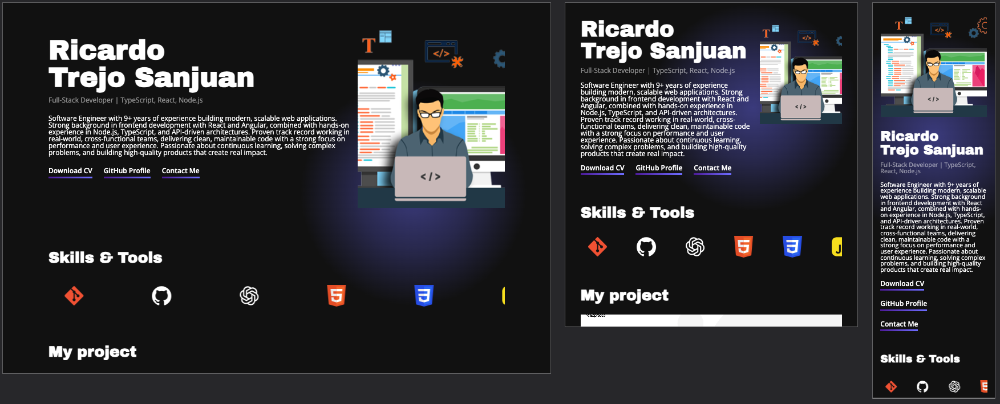

# 💻 Personal Portfolio Website

A modern and responsive personal portfolio to showcase projects, skills, and professional experience.

## 🚀 Live Demo

👉 **[View Live Demo](https://ricardotrejosanjuan.github.io/web_project_portfolio_es/)**

## 📖 Project Description

This project is a **personal portfolio website** designed to present my **professional profile, skills, and selected projects** in a clean and visually engaging way.
The main goal of this project is to **create a strong online presence** while applying **modern CSS layout techniques** and best practices for responsive design.

The portfolio focuses on **clarity, performance, and scalability**, serving both as a personal brand website and a foundation for future enhancements.

## ✨ Features

- Responsive layout optimized for desktop, tablet, and mobile screens
- Projects section with live demo and GitHub links
- Animated skills section with continuous scrolling
- Clean and minimal UI with gradient highlights
- Contact section with social media links

## 🛠️ Technologies Used

- **HTML5** – Semantic structure and accessibility-focused markup
- **CSS3** – Flexbox, Grid, custom properties (CSS variables), animations, and responsive design
- **GitHub Pages** – Deployment and hosting of the live demo

> The main focus of this project was to **master layout techniques (Flexbox & Grid)** and build a **scalable, maintainable CSS architecture**.

## 🚀 Future Improvements

- Add dark/light theme toggle
- Add more projects with filtering options

## 👤 Author

| Nombre                | Proyecto                   | Tipo          |
| --------------------- | -------------------------- | ------------- |
| Ricardo Trejo Sanjuan | Personal Portfolio Website | Frontend / UI |
